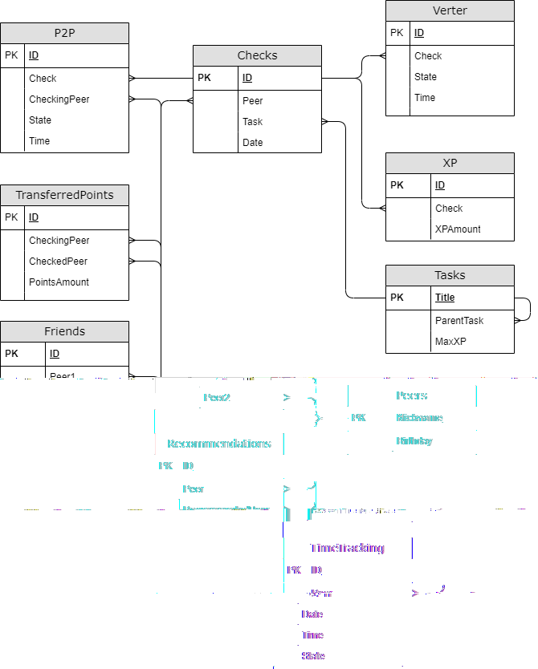

# Info v1.0 (Group project, 2 members)

Data analysis and statistics for the school.

## My part of the project

I've made Part 3 of the task and added csv data for it.

So for my code you can check files:

+ [part3.sql](./src/part3.sql)
+ [part3_test.sql](./src/part3_test.sql)

## Score:

The final score is 120% (max).

## Task

You will need to create a database with data about the school and write procedures and functions to retrieve information, as well as procedures and triggers to change it.

## Logical view of database model

### Notes

#### Tasks table

To access the task, you must complete the task that is its entry condition.
For simplicity, assume that each task has only one entry condition.
There must be one task in the table that has no entry condition (i.e., the ParentTask field is null).

#### Check status

Create an enumeration type for the check status that contains the following values:
- Start - the check starts
- Success - successful completion of the check
- Failure - unsuccessful completion of the check

#### P2P Table

Each P2P check consists of 2 table records: the first has a start status, the second has a success or failure status. \
The table cannot contain more than one incomplete P2P check related to a specific task, a peer and a checking peer. \
Each P2P check (i.e. both records of which it consists) refers to the check in the Checks table to which it belongs. 

#### Verter Table

Each check by Verter consists of 2 table records: the first has a start status, the second has a success or failure status. \
Each check by Verter (i.e. both records of which it consists) refers to the check in the Checks table to which it belongs. \
Сheck by Verter can only refer to those checks in the Checks table that already include a successful P2P check.

#### Checks table

Describes the check of the task as a whole. The check necessarily includes a **one** P2P step and possibly a Verter step.
For simplicity, assume that peer to peer and autotests related to the same check always happen on the same day.

The check is considered successful if the corresponding P2P step is successful and the Verter step is successful, or if there is no Verter step.
The check is considered a failure if at least one of the steps is unsuccessful. This means that checks in which the P2P step has not yet been completed, or it is successful but the Verter step has not yet been completed, are neither successful nor failed.

#### TransferredPoints table

At each P2P check, the peer being checked passes one peer point to the checker.
This table contains all pairs of the peer being checked-the checker and the number of transferred peer points, that is the number of P2P checks of the specified peer by the specified checker.

#### Friends table

Friendship is mutual, i.e. the first peer is a friend of the second one, and vice versa.

#### Recommendations table

Everyone can like how the P2P check was performed by a particular peer. The peer specified in the Peer field recommends passing the P2P check from the peer in the RecommendedPeer field. 
Each peer can recommend either one or several checkers at a time.

#### XP Table

For each successful check, the peer who completes the task receives some amount of XP displayed in this table.
The amount of XP cannot exceed the maximum available number for the task being checked.
The first field of this table can only refer to successful checks.

#### TimeTracking table

This table contains information about peers' visits to campus.
When a peer enters campus, a record is added to the table with state 1, when leaving it adds a record with state 2. 

In tasks related to this table, the "out" action refers to all but the last Campus departure of the day.
There must be the same number of records with state 1 and state 2 for each peer during one day.

For example:

| ID  | Peer  | Date     | Time  | State |
| --- | ----- | -------- | ----- | ----- |
| 1   | Aboba | 22.03.22 | 13:37 | 1     |
| 2   | Aboba | 22.03.22 | 15:48 | 2     |
| 3   | Aboba | 22.03.22 | 16:02 | 1     |
| 4   | Aboba | 22.03.22 | 20:00 | 2     |

In this example, the only "out" is the record with an ID equal to 2. Peer with the nickname Aboba has been out of campus for 14 minutes.

## Part 1. Creating a database

Write a [*part1.sql*](./src/part1.sql) script that creates the database and all the tables described above.

Add procedures to the script that allow you to import and export data for each table from/to a file with a *.csv* extension. \
The *csv* file separator is specified as a parameter of each procedure.

## Part 2. Changing data

Create a [*part2.sql*](./src/part2.sql) script, in which, in addition to what is described below, add test queries/calls for each item.

##### 1) Write a procedure for adding P2P check
Parameters: nickname of the person being checked, checker's nickname, task name, [P2P check status]( #check-status), time. \
If the status is "start", add a record in the Checks table (use today's date). \
Add a record in the P2P table. \
If the status is "start", specify the record just added as a check, otherwise specify the check with the unfinished P2P step.

##### 2) Write a procedure for adding checking by Verter
Parameters: nickname of the person being checked, task name, [Verter check status](#check-status), time. \
Add a record to the Verter table (as a check specify the check of the corresponding task with the latest (by time) successful P2P step)

##### 3) Write a trigger: after adding a record with the "start" status to the P2P table, change the corresponding record in the TransferredPoints table

##### 4) Write a trigger: before adding a record to the XP table, check if it is correct
The record is considered correct if:
- The number of XP does not exceed the maximum available for the task being checked
- The Check field refers to a successful check
If the record does not pass the check, do not add it to the table.

### Part 3. Getting data

Create a [*part3.sql*](./src/part3.sql) script, in which you should include the necessary procedures and functions.

See comments in the [*part3.sql*](./src/part3.sql) with tasks.

## Bonus. Part 4. Metadata

For this part of the task, you need to create a separate database, in which to create the tables, functions, procedures, and triggers needed to test the procedures.

Add the creation and filling of this database, as well as the written procedures, to the [*part4.sql*](./src/part4.sql) file.

##### 1) Create a stored procedure that, without destroying the database, destroys all those tables in the current database whose names begin with the phrase 'TableName'.

##### 2) Create a stored procedure with an output parameter that outputs a list of names and parameters of all scalar user's SQL functions in the current database. Do not output function names without parameters. The names and the list of parameters must be in one string. The output parameter returns the number of functions found.

##### 3) Create a stored procedure with output parameter, which destroys all SQL DML triggers in the current database. The output parameter returns the number of destroyed triggers.

##### 4) Create a stored procedure with an input parameter that outputs names and descriptions of object types (only stored procedures and scalar functions) that have a string specified by the procedure parameter.

